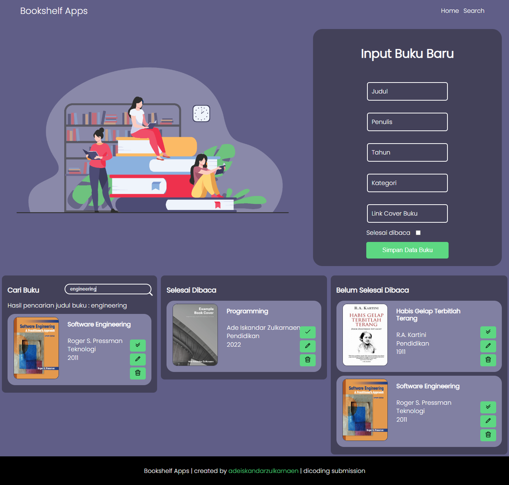

# bookshelf-apps

This bookshelf application is used for Dicoding Submission in the "Belajar Membuat Front-End Web untuk Pemula" class.
Little application made with pure CSS and vanilla JavaScript.

